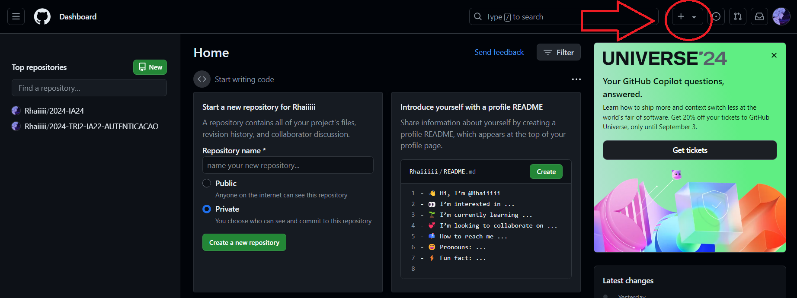
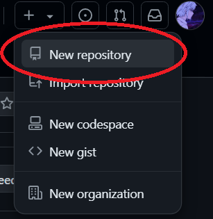
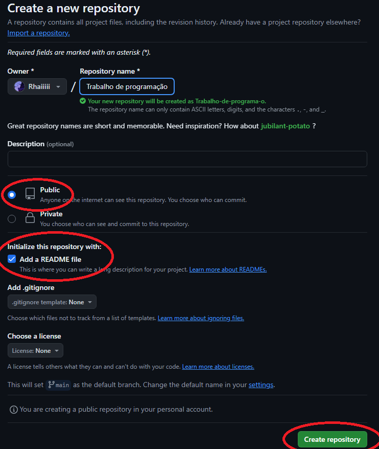

# Autenticação de Usuários

## 1. Criando um projeto no GitHub

Crie um novo repositório no GitHub:

``1 ->`` Vá até github.com.

``2 ->`` No canto superior direito, clique no ícone de "+" e depois em "New repository".

``3 ->`` Dê um nome ao seu repositório (ex: "Trabalho de programação") e clique em "Create repository".

___



___



___



___

## 2. Inicializando o projeto Node.js

No terminal, siga os seguintes passos para inicializar o projeto Node.js:

``copie e cole um de cada vez para que não dê erro!``

```bash
npm init -y
npm install express cors sqlite3 sqlite
npm install --save-dev typescript nodemon ts-node @types/express @types/cors
npx tsc --init
mkdir src
touch src/app.ts
```
Logo após isso aparecerá novos aquivos.


## Autenticação VS Autorização

...

## Autenticação com Token (JWT: um tipo de criptografia que guarda informações em um token)

...

## Projeto (Objeto de Estudos)

...